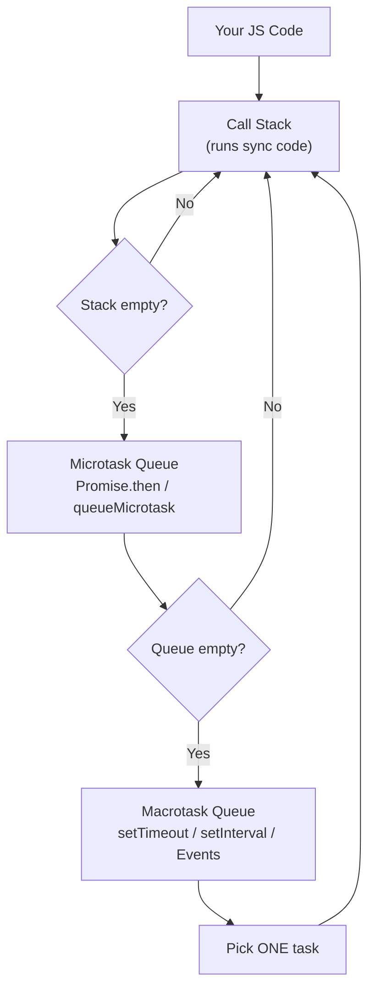
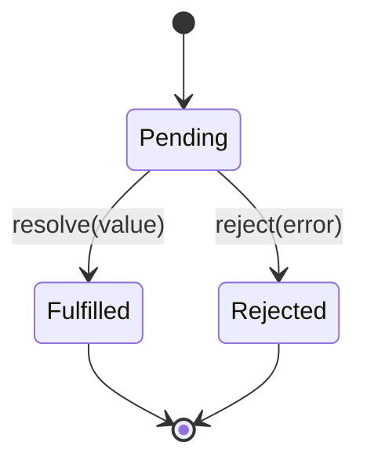
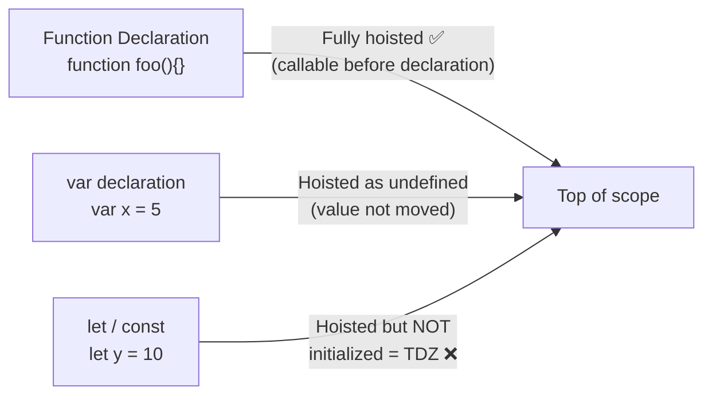
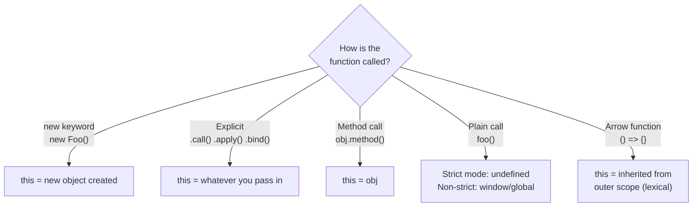
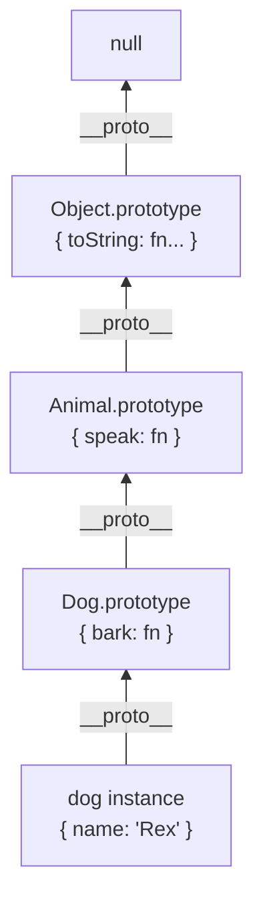
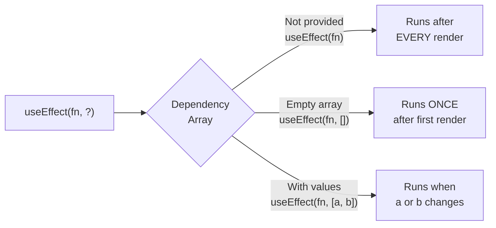
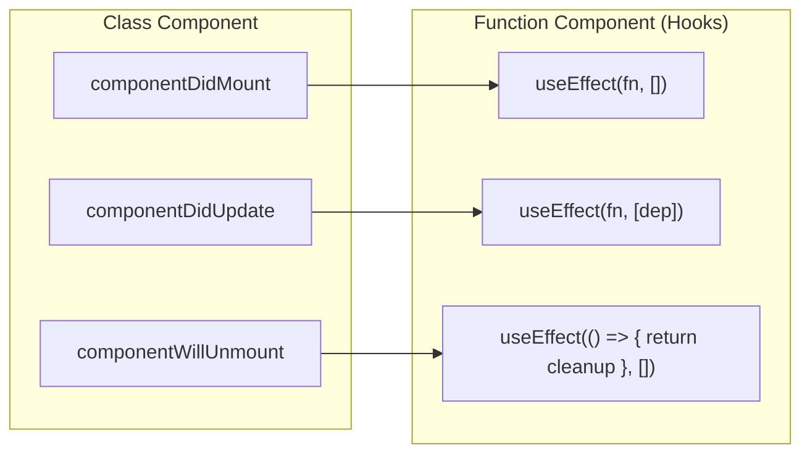
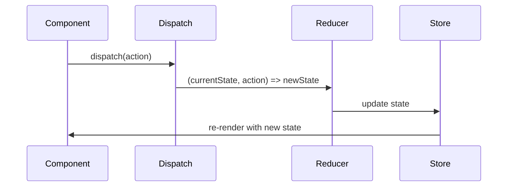
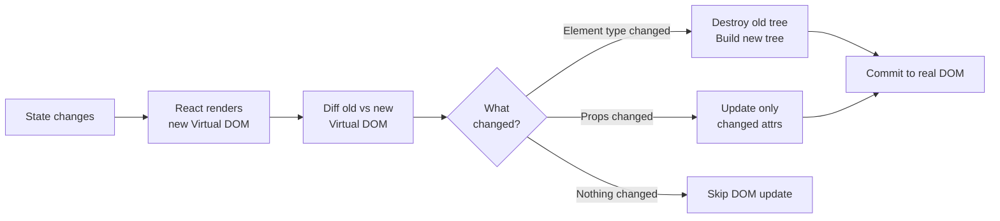
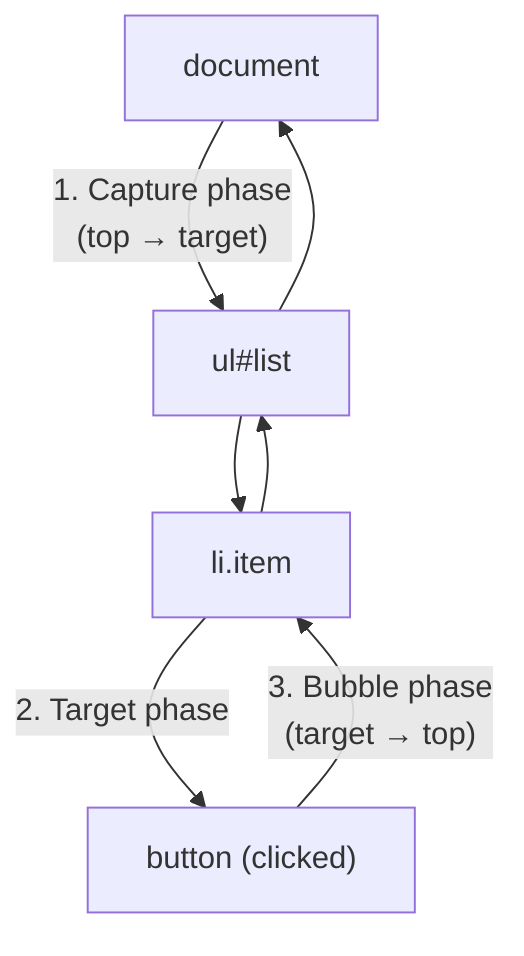

<div align="center">

# 🔥 frontend-crack

### The Last-Minute Frontend Interview Survival Guide

*20 must-know topics — explained simply, with code, diagrams & real interview Q&A*

[](https://github.com/yourusername/frontend-crack/stargazers)
[](https://github.com/yourusername/frontend-crack/network/members)
[](https://github.com/yourusername/frontend-crack/pulls)
[](https://opensource.org/licenses/MIT)

<br/>

> 💡 **Bookmark this repo.** Whether you have 1 week or 1 hour before your interview — this guide has you covered.

<br/>

⭐ **If this helps you land your dream job, please star the repo and share it with fellow developers!** ⭐

[🍴 Fork it](https://github.com/yourusername/frontend-crack/fork) · [⭐ Star it](https://github.com/yourusername/frontend-crack) · [🐛 Report an issue](https://github.com/yourusername/frontend-crack/issues)

</div>

---

## 📖 Table of Contents

### 🟡 JavaScript
| # | Topic |
|---|-------|
| 1 | [Closures & Scope](#1-closures--scope) |
| 2 | [Event Loop & Async](#2-event-loop--async) |
| 3 | [Promises & Async/Await](#3-promises--asyncawait) |
| 4 | [Hoisting & This Keyword](#4-hoisting--this-keyword) |
| 5 | [Prototypes & Inheritance](#5-prototypes--inheritance) |

### 🔵 React
| # | Topic |
|---|-------|
| 6 | [useState & useEffect](#6-usestate--useeffect) |
| 7 | [Context API & useContext](#7-context-api--usecontext) |
| 8 | [Custom Hooks](#8-custom-hooks) |
| 9 | [Component Lifecycle](#9-component-lifecycle) |
| 10 | [State Management — Redux / Zustand](#10-state-management--redux--zustand) |

### 🟢 Performance & Optimization
| # | Topic |
|---|-------|
| 11 | [Code Splitting & Lazy Loading](#11-code-splitting--lazy-loading) |
| 12 | [Memoization — useMemo & useCallback](#12-memoization--usememo--usecallback) |
| 13 | [Virtual DOM & Reconciliation](#13-virtual-dom--reconciliation) |
| 14 | [Bundle Optimization](#14-bundle-optimization) |
| 15 | [Web Vitals & Performance Metrics](#15-web-vitals--performance-metrics) |

### 🩷 Essential Concepts
| # | Topic |
|---|-------|
| 16 | [Event Delegation & Bubbling](#16-event-delegation--bubbling) |
| 17 | [Debouncing & Throttling](#17-debouncing--throttling) |
| 18 | [Error Boundaries & Error Handling](#18-error-boundaries--error-handling) |
| 19 | [Browser Storage](#19-browser-storage) |
| 20 | [REST APIs & HTTP Methods](#20-rest-apis--http-methods) |

---

## 🟡 JavaScript

---

### 1. Closures & Scope

#### 📌 Definition
> A **closure** is a function that **remembers the variables from its outer scope** even after the outer function has finished executing.

Think of it like a **backpack** 🎒 — when an inner function is created, it packs all the surrounding variables into a backpack and carries them wherever it goes.

---

#### 🔍 Sub-topics

<details>
<summary><strong>1a. Scope — What is it?</strong></summary>

**Scope** is the set of rules that determines where a variable can be accessed.

```
Global Scope
│
├── function outer() {        ← Function Scope
│     let x = 10;
│
│     function inner() {      ← Inner Function Scope
│       console.log(x);       ← can access x (closure!)
│     }
│   }
```

| Type | Declared with | Lives in |
|------|--------------|----------|
| Global | anywhere outside functions | everywhere |
| Function | `var` | the function it's in |
| Block | `let`, `const` | the `{ }` block it's in |

</details>

<details>
<summary><strong>1b. var vs let vs const</strong></summary>

```javascript
// var — function scoped, hoisted as undefined
function example() {
  console.log(a); // undefined (not an error — hoisted!)
  var a = 5;
  console.log(a); // 5
}

// let — block scoped, NOT accessible before declaration
{
  // console.log(b); // ❌ ReferenceError (Temporal Dead Zone)
  let b = 10;
  console.log(b); // ✅ 10
}
// console.log(b); // ❌ ReferenceError — outside block

// const — block scoped, must be initialised, cannot be reassigned
const PI = 3.14;
// PI = 3; // ❌ TypeError
```

</details>

<details>
<summary><strong>1c. Closures — The Classic Loop Trap 🪤</strong></summary>

This is **the most common closure interview gotcha**:

```javascript
// ❌ var — all iterations share the SAME variable
for (var i = 0; i < 3; i++) {
  setTimeout(() => console.log(i), 100);
}
// Output: 3, 3, 3 — by the time callbacks fire, i is already 3

// ✅ let — each iteration gets its OWN copy of i
for (let j = 0; j < 3; j++) {
  setTimeout(() => console.log(j), 100);
}
// Output: 0, 1, 2 — each j is a separate variable
```

</details>

<details>
<summary><strong>1d. Practical Closure — Counter Factory</strong></summary>

```javascript
function makeCounter(start = 0) {
  let count = start; // private variable — can't be accessed from outside

  return {
    increment: () => ++count,
    decrement: () => --count,
    value:     () => count,
  };
}

const counterA = makeCounter(0);
const counterB = makeCounter(10); // completely independent!

counterA.increment(); // 1
counterA.increment(); // 2
counterB.increment(); // 11 — counterB has its own count
```

**Real-world uses:** data privacy, memoization, event handlers with private state, the module pattern.

</details>

#### ❓ Interview Q&A

**Q: What is a closure?**
> A closure is a function that retains access to its lexical scope even when executed outside that scope. Every time a function is created in JavaScript, a closure is formed.

**Q: Can closures cause memory leaks?**
> Yes. If a closure holds a reference to a large object (like a DOM node), and the closure itself is kept alive (e.g., attached as an event listener), the large object cannot be garbage collected. Always remove event listeners when they are no longer needed.

#### ⚠️ Common Traps
- **`var` in loops** → use `let` instead
- **Confusing scope with `this`** → they are completely separate concepts
- **Memory leaks** → closures keep their outer scope alive in memory

---

### 2. Event Loop & Async

#### 📌 Definition
> The **Event Loop** is the mechanism that allows JavaScript (which is **single-threaded**) to handle asynchronous operations without blocking the main thread.

---

#### 🔍 Sub-topics

<details>
<summary><strong>2a. The Big Picture — Call Stack, Queues & Event Loop</strong></summary>



**The order is always:**
1. Run all synchronous code (Call Stack)
2. Drain **all** microtasks (Promises)
3. *(Browser may repaint here)*
4. Pick **one** macrotask (setTimeout etc.)
5. Repeat

</details>

<details>
<summary><strong>2b. Microtasks vs Macrotasks</strong></summary>

| | Microtasks | Macrotasks |
|---|---|---|
| **What** | Promise callbacks, `queueMicrotask()` | `setTimeout`, `setInterval`, UI events, `fetch` |
| **Priority** | 🔴 High — ALL run before next macrotask | 🟢 Normal — one per loop iteration |
| **When** | After every task, before browser paint | Once per event loop turn |

</details>

<details>
<summary><strong>2c. The Classic Output-Order Quiz</strong></summary>

```javascript
console.log('1');           // sync

setTimeout(() => {
  console.log('2');         // macrotask
}, 0);

Promise.resolve()
  .then(() => console.log('3'))  // microtask
  .then(() => console.log('4')); // microtask (chained)

console.log('5');           // sync

// Output: 1 → 5 → 3 → 4 → 2
```

**Why?**
- `1` and `5` are synchronous → run immediately
- `3` and `4` are microtasks → run after stack clears, before macrotasks
- `2` is a macrotask → runs last, even with `0ms` delay

</details>

#### ❓ Interview Q&A

**Q: Why is JavaScript single-threaded? Isn't that a limitation?**
> Single-threading simplifies a lot — no race conditions, no deadlocks, no complex thread synchronisation. The Event Loop compensates by handling async work efficiently. For CPU-heavy work, Web Workers can run code on separate threads.

**Q: What happens if you create an infinite loop of Promises?**
> The microtask queue never empties. The browser can never paint, can never process user events, and effectively freezes — it's a "microtask storm."

#### ⚠️ Common Traps
- `setTimeout(fn, 0)` does NOT mean "run immediately" — it's still a macrotask
- Heavy synchronous loops **block the Event Loop** and freeze the UI
- Infinite microtask chains starve the macrotask queue

---

### 3. Promises & Async/Await

#### 📌 Definition
> A **Promise** is an object representing the eventual result of an async operation. It can be **pending**, **fulfilled**, or **rejected**.
> **Async/Await** is syntactic sugar over Promises that makes async code read like synchronous code.

---

#### 🔍 Sub-topics

<details>
<summary><strong>3a. Promise States</strong></summary>



Once a Promise is settled (fulfilled or rejected) it **cannot change state**.

</details>

<details>
<summary><strong>3b. Creating & Chaining Promises</strong></summary>

```javascript
// Creating a Promise
const fetchUser = (id) => new Promise((resolve, reject) => {
  if (id <= 0) reject(new Error('Invalid ID'));
  else resolve({ id, name: 'Alice' });
});

// Chaining
fetchUser(1)
  .then(user => user.name)       // transform the value
  .then(name => name.toUpperCase())
  .catch(err => console.error(err)) // catches ANY error above
  .finally(() => console.log('done')); // always runs
```

</details>

<details>
<summary><strong>3c. Async/Await</strong></summary>

```javascript
// Same logic — much cleaner to read
async function loadUser(id) {
  try {
    const user = await fetchUser(id); // pauses HERE until Promise settles
    const name = user.name.toUpperCase();
    console.log(name);
  } catch (err) {
    console.error(err); // catches rejections
  } finally {
    console.log('done');
  }
}
```

> ⚠️ `async` functions **always return a Promise**, even if you return a plain value.

</details>

<details>
<summary><strong>3d. Promise Combinators — The Power Tools</strong></summary>

```javascript
const p1 = fetch('/api/users');
const p2 = fetch('/api/posts');
const p3 = fetch('/api/comments');

// Promise.all — parallel, fail-fast ⚡
// Resolves when ALL resolve. Rejects immediately if ANY reject.
const [users, posts] = await Promise.all([p1, p2]);

// Promise.allSettled — parallel, never fails 🛡️
// Waits for ALL to settle, gives results for each.
const results = await Promise.allSettled([p1, p2, p3]);
results.forEach(r => {
  if (r.status === 'fulfilled') console.log(r.value);
  else console.error(r.reason);
});

// Promise.race — first one wins 🏁
const fastest = await Promise.race([p1, p2]); // whichever resolves first

// Promise.any — first SUCCESS wins (ignores rejections)
const firstSuccess = await Promise.any([p1, p2, p3]);
```

| Method | Resolves when | Rejects when |
|--------|--------------|-------------|
| `Promise.all` | ALL resolve | ANY rejects |
| `Promise.allSettled` | ALL settle | Never |
| `Promise.race` | FIRST settles | FIRST settles (if rejected) |
| `Promise.any` | FIRST resolves | ALL reject |

</details>

#### ❓ Interview Q&A

**Q: What's the difference between `Promise.all` and `Promise.allSettled`?**
> `Promise.all` is fail-fast — one failure cancels everything. Use it when you need ALL results and any failure is a deal-breaker. `Promise.allSettled` waits for everything and tells you which succeeded and which failed — use it when partial results are acceptable.

**Q: Why can't you make `useEffect`'s callback directly async?**
> `useEffect` expects the callback to return either nothing or a cleanup function. An async function always returns a Promise — React doesn't know how to use that as cleanup. Solution: define an async function inside the callback and call it immediately.

#### ⚠️ Common Traps
- **Sequential awaits** when requests are independent = wasted time. Use `Promise.all` to run them in parallel.
- **Unhandled rejections** will crash Node.js in newer versions — always `.catch()` or `try/catch`
- Forgetting that `async` functions always return a Promise — remember to `await` them at the call site

---

### 4. Hoisting & This Keyword

#### 📌 Definition
> **Hoisting** is JavaScript's behaviour of moving declarations to the top of their scope before execution.
> **`this`** is a keyword that refers to the object currently executing the function — its value depends entirely on *how* the function is called.

---

#### 🔍 Sub-topics

<details>
<summary><strong>4a. Hoisting — What gets moved?</strong></summary>



```javascript
// Function declarations — fully hoisted
greet(); // ✅ works! Output: "Hello"
function greet() { console.log("Hello"); }

// var — hoisted as undefined
console.log(a); // undefined (no error)
var a = 5;
console.log(a); // 5

// let / const — Temporal Dead Zone (TDZ)
// console.log(b); // ❌ ReferenceError
let b = 10;
```

**Temporal Dead Zone (TDZ):** The zone between the start of the block and the `let`/`const` declaration line — the variable exists but cannot be accessed.

</details>

<details>
<summary><strong>4b. The `this` Keyword — 4 Rules</strong></summary>



```javascript
const obj = {
  name: 'Alice',

  // Regular method — this = obj when called as obj.greet()
  greet() {
    console.log(this.name); // 'Alice'
  },

  // Arrow function — this = wherever the OBJECT was defined
  greetArrow: () => {
    console.log(this.name); // undefined (inherits outer this)
  }
};

obj.greet();       // 'Alice'   ✅
obj.greetArrow();  // undefined ❌

// Losing 'this' when assigning to a variable
const fn = obj.greet;
fn();              // undefined (plain call — default binding)
fn.call(obj);      // 'Alice'   ✅ (explicit binding)
```

</details>

<details>
<summary><strong>4c. Fixing `this` — 3 Ways</strong></summary>

```javascript
class Timer {
  constructor() {
    this.seconds = 0;
  }

  // ❌ Problem: 'this' is undefined inside setTimeout callback
  startBroken() {
    setInterval(function() {
      this.seconds++; // 'this' is NOT the Timer instance here
    }, 1000);
  }

  // ✅ Fix 1: Arrow function (lexical this)
  startArrow() {
    setInterval(() => {
      this.seconds++; // arrow inherits 'this' from startArrow
    }, 1000);
  }

  // ✅ Fix 2: .bind()
  startBind() {
    setInterval(function() {
      this.seconds++;
    }.bind(this), 1000); // permanently bind 'this'
  }

  // ✅ Fix 3: save 'this' in a variable
  startSelf() {
    const self = this;
    setInterval(function() {
      self.seconds++;
    }, 1000);
  }
}
```

</details>

#### ❓ Interview Q&A

**Q: What is the Temporal Dead Zone?**
> The TDZ is the period between the start of a block scope and the line where a `let`/`const` variable is declared. The variable is hoisted (the engine knows it exists) but is not yet initialised — accessing it throws a `ReferenceError`.

**Q: What does `this` refer to inside an arrow function?**
> Arrow functions have **no own `this`**. They inherit `this` from the lexical scope in which they were defined — not from how they are called. This makes them perfect for callbacks inside methods.

#### ⚠️ Common Traps
- **`var` hoisting surprise:** `var` hoisted as `undefined` — reading it before assignment doesn't throw, it just silently returns `undefined`
- **Arrow functions as object methods** — avoid using arrow functions as methods if you need `this` to refer to the object
- **`this` in callbacks** — passing a method as a callback loses its `this` binding; use `.bind()` or an arrow wrapper

---

### 5. Prototypes & Inheritance

#### 📌 Definition
> JavaScript inheritance is **prototype-based**. Every object has a hidden link (`[[Prototype]]`) to another object. When a property is not found on an object, JavaScript automatically walks up this **prototype chain** until it finds it or hits `null`.

---

#### 🔍 Sub-topics

<details>
<summary><strong>5a. The Prototype Chain</strong></summary>



```javascript
const dog = new Dog('Rex');

dog.bark();    // ✅ found on Dog.prototype
dog.speak();   // ✅ found on Animal.prototype (walked up the chain)
dog.toString(); // ✅ found on Object.prototype
dog.fly();      // ❌ not found anywhere → TypeError
```

</details>

<details>
<summary><strong>5b. Prototypal Inheritance (Pre-ES6)</strong></summary>

```javascript
function Animal(name) {
  this.name = name;
}
// Methods on prototype — shared by ALL instances (not copied to each)
Animal.prototype.speak = function() {
  return `${this.name} makes a sound.`;
};

function Dog(name, breed) {
  Animal.call(this, name); // call parent constructor
  this.breed = breed;
}

// Set up the chain: Dog.prototype → Animal.prototype
Dog.prototype = Object.create(Animal.prototype);
Dog.prototype.constructor = Dog; // fix broken constructor reference

Dog.prototype.bark = function() {
  return `${this.name} barks!`;
};

const rex = new Dog('Rex', 'Labrador');
rex.speak(); // "Rex makes a sound."  (from Animal.prototype)
rex.bark();  // "Rex barks!"          (from Dog.prototype)
```

</details>

<details>
<summary><strong>5c. ES6 Classes — Syntactic Sugar</strong></summary>

```javascript
// This is EXACTLY the same as the code above — just cleaner syntax
class Animal {
  constructor(name) {
    this.name = name;
  }
  speak() {
    return `${this.name} makes a sound.`;
  }
}

class Dog extends Animal {
  constructor(name, breed) {
    super(name); // calls Animal constructor
    this.breed = breed;
  }
  bark() {
    return `${this.name} barks!`;
  }
}

const rex = new Dog('Rex', 'Labrador');
rex instanceof Dog;    // true
rex instanceof Animal; // true (prototype chain!)
```

> ⚠️ **There are no true classes in JavaScript.** `class` is just syntactic sugar over the same prototype mechanism.

</details>

<details>
<summary><strong>5d. Useful Object Methods</strong></summary>

```javascript
// Check own vs inherited properties
rex.hasOwnProperty('name');  // true — own property
rex.hasOwnProperty('speak'); // false — inherited from prototype

// Object.create — set prototype explicitly
const proto = { greet() { return 'Hello'; } };
const obj = Object.create(proto); // obj.__proto__ === proto
obj.greet(); // 'Hello'

// Object.create(null) — object with NO prototype (pure dictionary)
const dict = Object.create(null);
// dict.toString is undefined — no prototype chain!
```

</details>

#### ❓ Interview Q&A

**Q: What's the difference between `Object.create()` and `new`?**
> `new` calls the constructor function and sets up the prototype. `Object.create(proto)` creates a plain object whose prototype is explicitly set to `proto`, without calling any constructor. `Object.create(null)` creates an object with no prototype at all.

**Q: Why put methods on the prototype instead of inside the constructor?**
> If you define methods inside the constructor, every instance gets its own copy of the method in memory — wasteful for thousands of instances. Methods on the prototype are defined once and shared by all instances.

#### ⚠️ Common Traps
- **Modifying built-in prototypes** (`Array.prototype.myFn = ...`) — dangerous, breaks third-party code
- **Forgetting `super()` in a subclass constructor** — always call `super()` before using `this`
- **`instanceof` check can fail** across iframes/windows because each has its own prototype chain

---

## 🔵 React

---

### 6. useState & useEffect

#### 📌 Definitions
> **`useState`** — A hook that adds a reactive state variable to a function component. Changing it **triggers a re-render**.
> **`useEffect`** — A hook for synchronising a component with an **external system** (API, DOM, timer, subscription) after rendering.

---

#### 🔍 Sub-topics

<details>
<summary><strong>6a. useState — How it works</strong></summary>

```javascript
const [state, setState] = useState(initialValue);
//     ↑            ↑            ↑
// current value  setter fn   only used on first render
```

```javascript
function Counter() {
  const [count, setCount] = useState(0);

  // ✅ Functional update — always use this when new state depends on old state
  const increment = () => setCount(prev => prev + 1);

  // ❌ Direct update — stale closure risk in async code
  // const increment = () => setCount(count + 1);

  return <button onClick={increment}>{count}</button>;
}
```

**Key insight:** Each render gets a **snapshot** of state — the value is frozen for that render's lifetime.

</details>

<details>
<summary><strong>6b. useEffect — The Dependency Array</strong></summary>



```javascript
useEffect(() => {
  // Runs after every render — be careful, easy to cause infinite loops
});

useEffect(() => {
  // Runs once on mount — like componentDidMount
  fetchInitialData();
}, []);

useEffect(() => {
  // Runs when userId changes — like componentDidUpdate
  fetchUser(userId);
}, [userId]);

useEffect(() => {
  const timer = setInterval(tick, 1000);
  return () => clearInterval(timer); // ← cleanup on unmount / before next run
}, []);
```

</details>

<details>
<summary><strong>6c. Data Fetching Pattern (Best Practice)</strong></summary>

```javascript
function UserProfile({ userId }) {
  const [user, setUser]       = useState(null);
  const [loading, setLoading] = useState(true);
  const [error, setError]     = useState(null);

  useEffect(() => {
    const controller = new AbortController();
    setLoading(true);
    setError(null);

    fetch(`/api/users/${userId}`, { signal: controller.signal })
      .then(res => {
        if (!res.ok) throw new Error(`Error: ${res.status}`);
        return res.json();
      })
      .then(data => { setUser(data); setLoading(false); })
      .catch(err => {
        if (err.name !== 'AbortError') setError(err.message);
      });

    // Cleanup: cancel request if userId changes or component unmounts
    return () => controller.abort();
  }, [userId]);

  if (loading) return <p>Loading...</p>;
  if (error)   return <p>Error: {error}</p>;
  return <h1>{user?.name}</h1>;
}
```

</details>

#### ❓ Interview Q&A

**Q: What is the stale closure bug in useEffect?**
> If you use a state/prop variable inside `useEffect` but don't include it in the dependency array, the effect captures an outdated (stale) snapshot of that variable. The effect never sees the updated value. The ESLint `react-hooks/exhaustive-deps` rule catches this automatically.

**Q: Why does React run effects twice in development?**
> React 18 Strict Mode intentionally mounts → unmounts → mounts components twice in development to help you catch effects that don't clean up properly. This does NOT happen in production.

#### ⚠️ Common Traps
- **Infinite loop:** effect updates state that is in its own dependency array → re-render → effect → re-render...
- **`async` directly in `useEffect`:** async functions return a Promise; React doesn't accept that as a cleanup function. Define async inside and call it.
- **Missing dependencies:** always include all values the effect reads from the component scope

---

### 7. Context API & useContext

#### 📌 Definition
> **Context API** solves **prop drilling** — passing data through many intermediate components that don't need it just to reach a deeply nested component that does. Context creates a broadcast channel that any component in the subtree can subscribe to.

---

#### 🔍 Sub-topics

<details>
<summary><strong>7a. The Prop Drilling Problem</strong></summary>

```
Without Context (Prop Drilling 😫)
App (has theme)
 └─ Layout (passes theme down)
     └─ Sidebar (passes theme down)
         └─ Button (actually uses theme!)

With Context (Direct Access 🎉)
App → ThemeContext.Provider (value=theme)
 └─ Layout          (doesn't need theme prop)
     └─ Sidebar     (doesn't need theme prop)
         └─ Button → useContext(ThemeContext) ✅
```

</details>

<details>
<summary><strong>7b. Full Context Setup Pattern</strong></summary>

```javascript
// 1. Create context (with a sensible default value)
const ThemeContext = React.createContext('light');

// 2. Create a custom hook for clean consumption
function useTheme() {
  const context = useContext(ThemeContext);
  if (!context) throw new Error('useTheme must be used within ThemeProvider');
  return context;
}

// 3. Provider component
function ThemeProvider({ children }) {
  const [theme, setTheme] = useState('dark');

  // ✅ Memoize value to avoid unnecessary re-renders of all consumers
  const value = useMemo(() => ({ theme, setTheme }), [theme]);

  return (
    <ThemeContext.Provider value={value}>
      {children}
    </ThemeContext.Provider>
  );
}

// 4. Consumer — anywhere in the tree
function ThemeToggle() {
  const { theme, setTheme } = useTheme();
  return (
    <button onClick={() => setTheme(t => t === 'dark' ? 'light' : 'dark')}>
      Current: {theme}
    </button>
  );
}
```

</details>

<details>
<summary><strong>7c. When to use Context vs other options</strong></summary>

| Scenario | Use |
|----------|-----|
| State used by 1–2 levels of components | Props |
| State used by many components across the tree | Context |
| State changes very frequently (every keystroke) | Local state + Zustand/Redux |
| User auth status, theme, locale | Context ✅ |
| Shopping cart with complex logic | Redux / Zustand |

</details>

#### ❓ Interview Q&A

**Q: Does Context replace Redux?**
> No. Context is a data distribution mechanism, not a state management solution. It re-renders every consumer whenever the context value changes. For high-frequency updates or complex state logic, Redux or Zustand handle this much more efficiently with selectors.

#### ⚠️ Common Traps
- **Not memoizing the context value** — `value={{ theme, setTheme }}` creates a new object on every render → all consumers re-render even if `theme` didn't change. Fix: `useMemo`.
- **One giant context** — split contexts by update frequency: `AuthContext`, `ThemeContext`, `LocaleContext` separately
- **Using Context for everything** — keep local state local; escalate to Context only when truly needed across the tree

---

### 8. Custom Hooks

#### 📌 Definition
> A **custom hook** is a JavaScript function whose name starts with `use` and that calls other React hooks. It lets you extract reusable stateful logic out of components — without creating extra components or using HOC/render prop patterns.

**Key rule:** Custom hooks share **logic**, not **state** — each component that uses a custom hook gets its own independent state.

---

#### 🔍 Sub-topics

<details>
<summary><strong>8a. Custom Hook vs Utility Function</strong></summary>

```javascript
// Regular utility function — cannot use hooks
function formatDate(date) {
  return new Date(date).toLocaleDateString(); // pure, no hooks needed ✅
}

// Custom hook — can use useState, useEffect, etc.
function useWindowSize() {
  const [size, setSize] = useState({
    width: window.innerWidth,
    height: window.innerHeight
  });

  useEffect(() => {
    const handle = () => setSize({ width: window.innerWidth, height: window.innerHeight });
    window.addEventListener('resize', handle);
    return () => window.removeEventListener('resize', handle);
  }, []);

  return size; // returns reactive data — updates on resize
}
```

</details>

<details>
<summary><strong>8b. Building a useFetch Hook</strong></summary>

```javascript
function useFetch(url) {
  const [data, setData]       = useState(null);
  const [loading, setLoading] = useState(true);
  const [error, setError]     = useState(null);

  useEffect(() => {
    const controller = new AbortController();
    setLoading(true);

    fetch(url, { signal: controller.signal })
      .then(res => {
        if (!res.ok) throw new Error(`HTTP ${res.status}`);
        return res.json();
      })
      .then(data => { setData(data); setLoading(false); })
      .catch(err => { if (err.name !== 'AbortError') setError(err.message); });

    return () => controller.abort();
  }, [url]);

  return { data, loading, error };
}

// Usage — zero duplication across components
function UserList() {
  const { data: users, loading, error } = useFetch('/api/users');
  if (loading) return <Spinner />;
  if (error)   return <p>{error}</p>;
  return <ul>{users.map(u => <li key={u.id}>{u.name}</li>)}</ul>;
}

function PostList() {
  const { data: posts, loading, error } = useFetch('/api/posts');
  // UserList and PostList each have their OWN loading/data/error state
  // ...
}
```

</details>

#### ❓ Interview Q&A

**Q: Why must custom hook names start with `use`?**
> The `use` prefix tells React (and ESLint) to apply the Rules of Hooks to this function — it can use state, run effects, and obey the no-conditional-hooks rule. Without the prefix, linting won't catch violations and React may behave unpredictably.

**Q: Can two components share state through a custom hook?**
> No — each component gets its own isolated state. To share state between components, you need to lift state up, use Context, or use an external store like Zustand.

#### ⚠️ Common Traps
- **Forgetting the `use` prefix** — lint rules won't apply, conditional hook calls go undetected
- **Too granular** — if a custom hook wraps just one hook call with no extra logic, it adds indirection for no benefit
- **Returning too much** — expose a clean, minimal interface from your hook; hide internal implementation details

---

### 9. Component Lifecycle

#### 📌 Definition
> Every React component goes through three lifecycle phases: **Mounting** (added to the DOM), **Updating** (re-rendered due to state/prop changes), and **Unmounting** (removed from the DOM).

---

#### 🔍 Sub-topics

<details>
<summary><strong>9a. Class vs Hooks Lifecycle Mapping</strong></summary>



```javascript
// componentDidMount equivalent — runs ONCE after first render
useEffect(() => {
  console.log('Mounted!');
}, []);

// componentDidUpdate equivalent — runs when 'id' changes
useEffect(() => {
  console.log('id updated:', id);
}, [id]);

// componentWillUnmount equivalent — the return (cleanup) function
useEffect(() => {
  const timer = setInterval(tick, 1000);
  return () => {
    console.log('Unmounting — clearing timer');
    clearInterval(timer);
  };
}, []);
```

</details>

<details>
<summary><strong>9b. The Full Render Cycle</strong></summary>

```
1. Component function runs (render phase)
   ↓
2. React builds / updates Virtual DOM
   ↓
3. React commits changes to real DOM (commit phase)
   ↓
4. useLayoutEffect runs (sync, before browser paint)
   ↓
5. Browser paints the screen
   ↓
6. useEffect runs (async, after paint)
```

**`useLayoutEffect` vs `useEffect`:**
- `useLayoutEffect` — runs **synchronously** after DOM mutation but **before** the browser paints. Use for measuring DOM elements (getting size/position) and making layout adjustments.
- `useEffect` — runs **asynchronously** after paint. Use for everything else (data fetching, subscriptions, timers).

</details>

#### ❓ Interview Q&A

**Q: What is `getDerivedStateFromProps` and when would you use it?**
> It's a rarely-needed class component static method that lets you update state based on incoming props before render. In function components, you almost never need this — just derive values directly in the render function, or use `useEffect` for side effects based on prop changes.

#### ⚠️ Common Traps
- **React 18 Strict Mode** runs effects twice (mount → unmount → mount) in development — this is intentional to catch cleanup bugs
- **The cleanup function runs before every re-run** of the effect, not only on unmount — this surprises many developers
- **`useLayoutEffect` on the server** — throws an error during SSR (server-side rendering). Use `useEffect` for SSR-compatible code

---

### 10. State Management — Redux / Zustand

#### 📌 Definitions
> **Redux** — A state container with a strict pattern: one global store, actions to describe changes, pure reducer functions to apply them. Predictable, debuggable, powerful.
> **Zustand** — A lightweight, unopinionated state manager. Less boilerplate, same power for most use cases.

---

#### 🔍 Sub-topics

<details>
<summary><strong>10a. The Redux Data Flow</strong></summary>



</details>

<details>
<summary><strong>10b. Redux Toolkit (Modern Redux)</strong></summary>

```javascript
import { createSlice, configureStore } from '@reduxjs/toolkit';

// Slice = reducer + actions in one
const cartSlice = createSlice({
  name: 'cart',
  initialState: { items: [], total: 0 },
  reducers: {
    addItem(state, action) {
      // Immer makes this mutation-style code safe
      state.items.push(action.payload);
      state.total += action.payload.price;
    },
    removeItem(state, action) {
      state.items = state.items.filter(i => i.id !== action.payload);
    },
  },
});

export const { addItem, removeItem } = cartSlice.actions;

// Store
export const store = configureStore({
  reducer: { cart: cartSlice.reducer }
});

// In component
function Cart() {
  const items = useSelector(state => state.cart.items);
  const dispatch = useDispatch();
  return (
    <button onClick={() => dispatch(addItem({ id: 1, price: 9.99 }))}>
      Add ({items.length})
    </button>
  );
}
```

</details>

<details>
<summary><strong>10c. Zustand — Simpler Alternative</strong></summary>

```javascript
import { create } from 'zustand';

const useCartStore = create((set) => ({
  items: [],
  total: 0,

  addItem: (item) => set(state => ({
    items: [...state.items, item],
    total: state.total + item.price,
  })),

  removeItem: (id) => set(state => ({
    items: state.items.filter(i => i.id !== id),
  })),
}));

// In any component — no Provider needed!
function Cart() {
  const { items, addItem } = useCartStore();
  return <button onClick={() => addItem({ id: 1, price: 9.99 })}>Add</button>;
}
```

</details>

<details>
<summary><strong>10d. Choosing the Right Tool</strong></summary>

| Tool | When to use |
|------|------------|
| `useState` | State used by one component |
| `useReducer` | Complex local state transitions (form with many fields) |
| Context API | Slowly-changing global state (auth, theme, locale) |
| Zustand | Global state, simple to moderate complexity |
| Redux Toolkit | Large apps, complex state, time-travel debugging needed |
| React Query / SWR | Server state — async data from APIs |

> 💡 **Pro tip:** Server state (API data) is NOT application state. Use React Query for caching, loading, and refetching — don't put API data in Redux.

</details>

#### ⚠️ Common Traps
- **Redux for server state** — an anti-pattern. React Query handles caching and refetching; Redux doesn't.
- **Using Redux too early** — adds massive boilerplate for simple apps. Start with local state and escalate.
- **Context for high-frequency updates** — every consumer re-renders on change. Zustand handles this with selective subscriptions.

---

## 🟢 Performance & Optimization

---

### 11. Code Splitting & Lazy Loading

#### 📌 Definition
> **Code splitting** breaks your JavaScript bundle into smaller chunks. **Lazy loading** defers downloading those chunks until they are actually needed — users only download code for the parts of the app they actually visit.

---

#### 🔍 Sub-topics

<details>
<summary><strong>11a. The Problem — One Giant Bundle</strong></summary>

```
Without Code Splitting:
Browser downloads → app.bundle.js (2MB)
                     ↑ includes EVERYTHING: home, dashboard,
                       settings, admin — even pages never visited

With Code Splitting:
Browser downloads → main.js (200KB)     ← always downloaded
                  + dashboard.js (150KB) ← only when /dashboard visited
                  + settings.js (100KB)  ← only when /settings visited
```

</details>

<details>
<summary><strong>11b. Route-Based Splitting with React.lazy</strong></summary>

```javascript
import { lazy, Suspense } from 'react';
import { Routes, Route } from 'react-router-dom';

// These are NOT in the main bundle — downloaded on demand
const Dashboard = lazy(() => import('./pages/Dashboard'));
const Settings  = lazy(() => import('./pages/Settings'));
const AdminPage = lazy(() => import('./pages/Admin'));

function App() {
  return (
    <Suspense fallback={<PageSkeleton />}>
      <Routes>
        <Route path="/"          element={<HomePage />} />     {/* always bundled */}
        <Route path="/dashboard" element={<Dashboard />} />    {/* lazy loaded */}
        <Route path="/settings"  element={<Settings />} />     {/* lazy loaded */}
        <Route path="/admin"     element={<AdminPage />} />    {/* lazy loaded */}
      </Routes>
    </Suspense>
  );
}
```

</details>

<details>
<summary><strong>11c. Preloading — Load Before User Navigates</strong></summary>

```javascript
// Trigger the download early (before user clicks)
function NavBar() {
  return (
    <nav>
      <Link
        to="/dashboard"
        onMouseEnter={() => import('./pages/Dashboard')} // preload on hover!
      >
        Dashboard
      </Link>
    </nav>
  );
}
```

</details>

#### ❓ Interview Q&A

**Q: When should you NOT use lazy loading?**
> Don't lazy-load components that are immediately visible on first render (above-the-fold content). The extra network round-trip delays the initial paint, hurting LCP. Only lazy-load routes/components that a user actively navigates to.

#### ⚠️ Common Traps
- **Lazy loading above-the-fold content** → hurts LCP
- **No Suspense boundary** → React throws an error when a lazy component is pending
- **Over-splitting** → too many small chunks means too many network requests; find the right balance

---

### 12. Memoization — useMemo & useCallback

#### 📌 Definitions
> **`useMemo`** — Caches the **result** of a computation. Re-computes only when dependencies change.
> **`useCallback`** — Caches a **function reference**. Returns the same function between renders.
> **`React.memo`** — Wraps a component so it only re-renders if its **props changed**.

---

#### 🔍 Sub-topics

<details>
<summary><strong>12a. When React Re-renders</strong></summary>

```
A component re-renders when:
  1. Its own state changes
  2. Its parent re-renders (even if props didn't change!) ← the expensive one
  3. A context it consumes changes

React.memo stops #2 — it skips the re-render if props are the same.
```

</details>

<details>
<summary><strong>12b. The Three Tools Working Together</strong></summary>

```javascript
function ProductList({ products, category }) {

  // useMemo — cache expensive calculation
  const filtered = useMemo(() => {
    console.log('Filtering...'); // only logs when products/category change
    return products.filter(p => p.category === category);
  }, [products, category]);

  // useCallback — stable function reference for memoized child
  const handleSelect = useCallback((id) => {
    console.log('Selected:', id);
  }, []); // no deps — function never changes

  return filtered.map(p => (
    <ProductCard
      key={p.id}
      product={p}
      onSelect={handleSelect} // stable ref → Card won't re-render needlessly
    />
  ));
}

// React.memo — only re-renders if product or onSelect changes
const ProductCard = React.memo(({ product, onSelect }) => {
  console.log('Rendering card:', product.id); // see how often this runs
  return <div onClick={() => onSelect(product.id)}>{product.name}</div>;
});
```

</details>

<details>
<summary><strong>12c. useMemo vs useCallback</strong></summary>

```javascript
// useMemo — memoizes a VALUE
const sortedList = useMemo(() => {
  return [...items].sort((a, b) => a.name.localeCompare(b.name));
}, [items]);

// useCallback — memoizes a FUNCTION
const handleClick = useCallback(() => {
  doSomething(id);
}, [id]);

// useCallback is literally shorthand for:
const handleClick = useMemo(() => () => doSomething(id), [id]);
```

</details>

#### ❓ Interview Q&A

**Q: Should you wrap every function in `useCallback`?**
> No. Memoization has its own cost — dependency comparison, cache storage, added code complexity. Only apply it when profiling shows real performance issues from excessive re-renders. Premature optimisation with `useCallback` on every function makes code harder to read for no measurable benefit.

#### ⚠️ Common Traps
- **`React.memo` without `useCallback`** — if the parent re-renders and creates a new function reference, `React.memo` sees a "changed" prop and re-renders anyway. They must work together.
- **Wrong deps** — missing deps = stale values (bugs); extra deps = cache invalidates too often (defeats purpose)
- **Memoizing cheap operations** — don't `useMemo` for simple arithmetic or string concatenation; the memoization overhead outweighs the savings

---

### 13. Virtual DOM & Reconciliation

#### 📌 Definition
> The **Virtual DOM** is a lightweight JavaScript object tree that mirrors the real DOM. When state changes, React creates a new Virtual DOM tree, **diffs** it against the previous one (reconciliation), and applies only the necessary changes to the real DOM.

---

#### 🔍 Sub-topics

<details>
<summary><strong>13a. The Render → Diff → Commit Cycle</strong></summary>



</details>

<details>
<summary><strong>13b. Keys — How React Tracks List Items</strong></summary>

```javascript
// Without keys — React diffs by position
// Insert 'Alice' at the top → React thinks EVERY item changed ❌
[Bob, Carol]  →  [Alice, Bob, Carol]
// React: index 0 changed, index 1 changed, index 2 is new

// With stable keys — React diffs by identity ✅
// React: key='alice' is new; key='bob' and key='carol' are unchanged
users.map(user => <UserCard key={user.id} user={user} />);
//                           ↑ stable unique ID — never use index!
```

**Why not use index as key?**

```javascript
// ❌ Dangerous — deleting Alice shifts all indices
[Alice(0), Bob(1), Carol(2)]
// Delete Alice:
[Bob(0), Carol(1)]  // React sees index 0 changed, index 1 changed
// If Bob's component had local state — it now has ALICE's old state!
```

</details>

<details>
<summary><strong>13c. React 18 — Concurrent Rendering</strong></summary>

React 18 introduced Concurrent Mode — reconciliation can now be **interrupted and resumed**. React can:
- Pause a render in progress and handle urgent updates first (e.g., user typing)
- Resume, restart, or throw away a render tree as needed

Key APIs:
- `startTransition()` — mark state updates as non-urgent (can be interrupted)
- `useDeferred Value()` — defer an expensive re-render until the browser is idle

</details>

#### ⚠️ Common Traps
- **Index as key** — causes wrong components to receive wrong state after add/remove/reorder
- **Re-render ≠ DOM update** — React can re-render (call your function) many times but only update the DOM where the diff shows actual changes. Re-renders are cheaper than DOM updates.
- **Controlling when reconciliation runs** — use `React.memo`, `shouldComponentUpdate`, or `PureComponent` to bail out of reconciliation for components that haven't changed

---

### 14. Bundle Optimization

#### 📌 Definition
> Every KB of JavaScript must be downloaded, parsed, and executed before your app is interactive. **Bundle optimisation** reduces this cost through tree shaking, minification, compression, code splitting, and smart dependency management.

---

#### 🔍 Sub-topics

<details>
<summary><strong>14a. Tree Shaking</strong></summary>

```javascript
// ❌ Imports entire lodash (~70KB gzipped)
import _ from 'lodash';
const result = _.debounce(fn, 300);

// ✅ Imports only debounce (~2KB)
import debounce from 'lodash/debounce';
const result = debounce(fn, 300);

// ✅ Even better — use modern alternatives built for tree shaking
import { debounce } from 'lodash-es'; // ES module version
```

**Tree shaking requires ES Modules (`import`/`export`).** CommonJS (`require`) cannot be statically analysed, so dead code can't be removed.

</details>

<details>
<summary><strong>14b. Analysing Your Bundle</strong></summary>

```bash
# Vite — add to vite.config.js
npm install --save-dev rollup-plugin-visualizer

# Webpack
npm install --save-dev webpack-bundle-analyzer
```

**What to look for:**
- 🔴 Huge dependencies (moment.js, lodash) — replace with smaller alternatives
- 🔴 Duplicate packages at different versions
- 🔴 Everything in one chunk — add code splitting
- 🟡 Vendor chunk larger than app chunk — review third-party dependencies

</details>

<details>
<summary><strong>14c. Quick Wins Checklist</strong></summary>

| Optimization | Impact | How |
|---|---|---|
| Enable Brotli/Gzip | 🔴 High | Server/CDN config |
| Code split routes | 🔴 High | `React.lazy()` |
| Replace moment.js | 🟠 Medium | Use `date-fns` or `dayjs` |
| Import selectively | 🟠 Medium | `lodash/debounce` not `lodash` |
| Lazy load images | 🟠 Medium | `loading="lazy"` attribute |
| Minify CSS/JS | 🟠 Medium | Vite/Webpack default in prod |
| Cache static assets | 🟡 Long-term | `Cache-Control: max-age=31536000` |

</details>

#### ⚠️ Common Traps
- **Not checking bundle size before shipping** — use `bundlephobia.com` before installing any npm package
- **Skipping compression** — even a well-optimised bundle is slow without gzip/brotli on the server
- **Too many chunks** — over-splitting creates too many HTTP requests; balance chunk count vs size

---

### 15. Web Vitals & Performance Metrics

#### 📌 Definition
> **Core Web Vitals** are Google's user-centred performance metrics. They measure real-world user experience and **directly affect your SEO ranking**. Every frontend developer must know these.

---

#### 🔍 Sub-topics

<details>
<summary><strong>15a. The Three Core Web Vitals</strong></summary>

```
LCP — Largest Contentful Paint (Loading)
┌─────────────────────────────────────────────┐
│  How long until the MAIN content is visible? │
│  Target: < 2.5s  ✅  |  > 4s = Poor ❌       │
│  Usually: hero image or largest heading      │
└─────────────────────────────────────────────┘

INP — Interaction to Next Paint (Interactivity)
┌─────────────────────────────────────────────┐
│  How fast does the page respond to clicks?   │
│  Target: < 200ms ✅  |  > 500ms = Poor ❌    │
│  Replaces FID as of March 2024              │
└─────────────────────────────────────────────┘

CLS — Cumulative Layout Shift (Visual Stability)
┌─────────────────────────────────────────────┐
│  How much do elements unexpectedly JUMP?     │
│  Target: < 0.1   ✅  |  > 0.25 = Poor ❌    │
│  Caused by: images without dimensions,      │
│  late-loading ads, injected content          │
└─────────────────────────────────────────────┘
```

</details>

<details>
<summary><strong>15b. Additional Metrics</strong></summary>

| Metric | Measures | Good |
|--------|---------|------|
| **FCP** (First Contentful Paint) | Time to first content on screen | < 1.8s |
| **TTFB** (Time to First Byte) | Server response speed | < 800ms |
| **TBT** (Total Blocking Time) | Main thread blocked time | < 200ms |
| **Speed Index** | How quickly content is visually populated | < 3.4s |

</details>

<details>
<summary><strong>15c. How to Fix Each Metric</strong></summary>

**Improve LCP:**
```html
<!-- Preload the LCP image — don't wait for CSS to discover it -->
<link rel="preload" as="image" href="/hero.webp" fetchpriority="high">

<!-- Use modern image formats -->

```

**Improve CLS:**
```css
/* Always set dimensions on images — prevents layout shift */
img {
  width: 100%;
  height: auto;
  aspect-ratio: 16 / 9;  /* reserve space before image loads */
}
```

**Improve INP:**
- Break up Long Tasks (> 50ms) with `setTimeout` or `scheduler.yield()`
- Move heavy work to Web Workers
- Use `startTransition()` for non-urgent state updates

</details>

#### ❓ Interview Q&A

**Q: How do you measure Core Web Vitals in the field?**
> Lab tools (Lighthouse, WebPageTest) simulate conditions — useful for debugging but not what Google uses for ranking. Field data comes from real users via the Chrome User Experience Report (CrUX), visible in Google Search Console and PageSpeed Insights. Always optimise based on field data.

#### ⚠️ Common Traps
- **Optimising for Lighthouse only** — lab score ≠ real user experience. Field data reflects real devices and slow networks.
- **Images without dimensions** — the #1 cause of CLS. Always set `width` and `height` attributes.
- **FID vs INP confusion** — FID (First Input Delay) was replaced by INP (Interaction to Next Paint) in March 2024. Know both.

---

## 🩷 Essential Concepts

---

### 16. Event Delegation & Bubbling

#### 📌 Definitions
> **Event Bubbling** — When an event fires on an element, it propagates upward through every ancestor in the DOM tree.
> **Event Delegation** — Attaching a single listener on a parent to handle events for all its children, using bubbling.

---

#### 🔍 Sub-topics

<details>
<summary><strong>16a. The Three Phases of Events</strong></summary>



Most event listeners use the **bubble phase** by default.

</details>

<details>
<summary><strong>16b. Event Delegation Pattern</strong></summary>

```javascript
// ❌ Without delegation — 1,000 listeners for 1,000 items
document.querySelectorAll('.item').forEach(item => {
  item.addEventListener('click', handleClick); // 1,000 listeners!
});

// ✅ With delegation — 1 listener handles everything
const list = document.querySelector('#list');

list.addEventListener('click', (event) => {
  // event.target = the element that was actually clicked
  const item = event.target.closest('.item'); // handle clicks on children too
  if (!item) return;

  const id = item.dataset.id;
  handleItemClick(id);
});

// Bonus: also handles dynamically added items — no re-binding needed!
list.innerHTML += '<li class="item" data-id="999">New Item</li>';
// The click listener on 'list' catches clicks on this new item automatically
```

</details>

<details>
<summary><strong>16c. stopPropagation vs preventDefault</strong></summary>

```javascript
document.querySelector('.modal').addEventListener('click', (e) => {
  e.stopPropagation(); // ← stops the event bubbling UP to parent listeners
  // The modal's parent won't receive this click
});

document.querySelector('a.no-navigate').addEventListener('click', (e) => {
  e.preventDefault(); // ← cancels the BROWSER'S default action (navigation)
  // The link won't navigate, but the event still bubbles
});

// You can use both together
document.querySelector('form').addEventListener('submit', (e) => {
  e.preventDefault();   // don't submit the form natively
  e.stopPropagation();  // don't bubble to parent listeners
  handleSubmit();
});
```

</details>

#### ⚠️ Common Traps
- **Not all events bubble** — `focus`, `blur`, `load`, `scroll` don't bubble. Use `focusin`/`focusout` for delegation on focus events.
- **Overusing `stopPropagation`** — it can break other listeners up the chain (analytics, tooltip closers). Use it deliberately.
- **React already uses delegation** — React attaches a single listener to the root element, not to each component. Native DOM delegation is still useful outside React contexts.

---

### 17. Debouncing & Throttling

#### 📌 Definitions
> **Debounce** — Wait until a rapid burst of events has *paused* for X ms, then fire once.
> **Throttle** — Fire at most once every X ms, no matter how many events occur.

**Simple analogy:**
- 🚿 **Debounce** = a shower that starts only after you stop adjusting the temperature (waits for you to settle)
- 🚦 **Throttle** = a traffic light that only lets one car through every 30 seconds, regardless of queue length

---

#### 🔍 Sub-topics

<details>
<summary><strong>17a. Visual Comparison</strong></summary>

```
Event stream: ||||||||||||||||   pause   ||||||||   pause

Debounce (300ms):               ^                  ^
                            fires once           fires once
                         (after 300ms pause)

Throttle (300ms):  ^    ^    ^    ^    ^    ^    ^    ^
                fires at regular intervals regardless
```

</details>

<details>
<summary><strong>17b. Implementations from Scratch</strong></summary>

```javascript
// Debounce — cancel and restart timer on every call
function debounce(fn, delay) {
  let timerId;
  return function (...args) {
    clearTimeout(timerId);                          // cancel previous
    timerId = setTimeout(() => fn.apply(this, args), delay); // restart
  };
}

// Throttle — skip calls until interval has elapsed
function throttle(fn, interval) {
  let lastCall = 0;
  return function (...args) {
    const now = Date.now();
    if (now - lastCall >= interval) {
      lastCall = now;
      fn.apply(this, args);
    }
  };
}
```

</details>

<details>
<summary><strong>17c. In React (with useCallback)</strong></summary>

```javascript
import { useCallback, useRef } from 'react';

function SearchBar() {
  // ✅ useCallback keeps the debounced function stable across renders
  const debouncedSearch = useCallback(
    debounce((query) => {
      fetch(`/api/search?q=${query}`).then(/*...*/);
    }, 300),
    [] // created once, never recreated
  );

  return (
    <input
      onChange={(e) => debouncedSearch(e.target.value)}
      placeholder="Search..."
    />
  );
}

function InfiniteScroll() {
  const throttledLoad = useCallback(
    throttle(() => {
      loadMoreItems();
    }, 200),
    []
  );

  return <div onScroll={throttledLoad}>...</div>;
}
```

</details>

#### ❓ Interview Q&A

**Q: When would you use debounce vs throttle?**
> **Debounce:** When you want to react only *after* the user has finished a burst of actions — search input (fire after they stop typing), window resize (fire after they stop resizing), form auto-save.
> **Throttle:** When you need regular, rate-limited updates during continuous events — scroll handlers, mouse move, game input, analytics tracking.

#### ⚠️ Common Traps
- **Recreating debounced function on every render** — the timer resets each time. Use `useCallback` or define outside the component.
- **Not cancelling on unmount** — a pending debounced call may fire after the component unmounts. Use `lodash.debounce`'s `.cancel()` in useEffect cleanup.
- **Using `setTimeout` directly for throttle** — naive implementations miss edge cases. Prefer a proven library (lodash) or the implementations above.

---

### 18. Error Boundaries & Error Handling

#### 📌 Definitions
> **Error Boundary** — A React class component that catches JavaScript errors anywhere in its child component tree and displays a fallback UI instead of crashing the whole app.
> Without error boundaries, any render error crashes the **entire React tree** — users see a blank white page.

---

#### 🔍 Sub-topics

<details>
<summary><strong>18a. What Error Boundaries DO and DON'T catch</strong></summary>

```
✅ Error Boundaries CATCH:
  - Errors during rendering
  - Errors in lifecycle methods
  - Errors in constructors of child components

❌ Error Boundaries DO NOT catch:
  - Event handler errors  (use try/catch directly)
  - Async errors          (setTimeout, fetch, Promises)
  - SSR errors
  - Errors in the boundary itself
```

</details>

<details>
<summary><strong>18b. Building an Error Boundary</strong></summary>

```javascript
class ErrorBoundary extends React.Component {
  constructor(props) {
    super(props);
    this.state = { hasError: false, error: null };
  }

  // Called during render when a child throws
  static getDerivedStateFromError(error) {
    return { hasError: true, error };
  }

  // Called after the error — use for logging
  componentDidCatch(error, info) {
    logToErrorTracker(error, info.componentStack);
  }

  render() {
    if (this.state.hasError) {
      return this.props.fallback || (
        <div>
          <h2>Something went wrong.</h2>
          <button onClick={() => this.setState({ hasError: false })}>
            Try again
          </button>
        </div>
      );
    }
    return this.props.children;
  }
}

// Strategic placement — granular is better
function Dashboard() {
  return (
    <div>
      <ErrorBoundary fallback={<WidgetError name="Revenue" />}>
        <RevenueChart />     {/* isolated — failure doesn't crash dashboard */}
      </ErrorBoundary>

      <ErrorBoundary fallback={<WidgetError name="Users" />}>
        <UserTable />         {/* isolated — failure doesn't crash dashboard */}
      </ErrorBoundary>
    </div>
  );
}
```

</details>

<details>
<summary><strong>18c. Async Error Handling Pattern</strong></summary>

```javascript
// Event handlers need try/catch — NOT covered by Error Boundaries
async function handleSubmit(formData) {
  try {
    await submitOrder(formData);
    showSuccess('Order placed!');
  } catch (error) {
    if (error.status === 422) {
      setFormErrors(error.validationErrors);
    } else {
      showToast('Something went wrong. Please try again.');
      logError(error);
    }
  }
}

// Global unhandled rejection fallback
window.addEventListener('unhandledrejection', (event) => {
  logError(event.reason);
  event.preventDefault(); // prevents console error in some browsers
});
```

</details>

#### ⚠️ Common Traps
- **One top-level boundary is not enough** — a page-level fallback replaces the entire app UI. Wrap individual features for granular recovery.
- **Error boundaries must be class components** — there is no `useErrorBoundary` hook in React yet (though libraries like `react-error-boundary` provide a wrapper).
- **Not logging errors** — `componentDidCatch` is your opportunity to report to Sentry/Datadog. Don't silently swallow errors.

---

### 19. Browser Storage

#### 📌 Definition
> Browsers provide multiple ways to persist data on the client side. Choosing the right storage mechanism depends on the size, sensitivity, lifespan, and access pattern of the data.

---

#### 🔍 Sub-topics

<details>
<summary><strong>19a. Storage Types at a Glance</strong></summary>

| Feature | Cookie | localStorage | sessionStorage | IndexedDB |
|---------|--------|-------------|---------------|-----------|
| Capacity | ~4KB | ~5MB | ~5MB | Hundreds of MB |
| Persists after close | ✅ (if not session) | ✅ | ❌ | ✅ |
| Sent to server | ✅ Auto | ❌ | ❌ | ❌ |
| JS Accessible | ✅ (unless HttpOnly) | ✅ | ✅ | ✅ |
| Async | ❌ | ❌ | ❌ | ✅ |
| Good for | Auth tokens | Preferences | Wizard steps | Offline data |

</details>

<details>
<summary><strong>19b. localStorage — API & Best Practices</strong></summary>

```javascript
// Store — must stringify objects (localStorage is string-only)
const settings = { theme: 'dark', fontSize: 16 };
localStorage.setItem('settings', JSON.stringify(settings));

// Retrieve — always handle null and parse errors
function getItem(key, fallback = null) {
  try {
    const raw = localStorage.getItem(key);
    return raw ? JSON.parse(raw) : fallback;
  } catch {
    return fallback; // handles corrupted JSON
  }
}
const settings = getItem('settings', { theme: 'light' });

// Listen for changes in OTHER tabs
window.addEventListener('storage', (event) => {
  if (event.key === 'settings') {
    // Another tab updated settings — sync your UI
    updateSettings(JSON.parse(event.newValue));
  }
});
```

</details>

<details>
<summary><strong>19c. Why NOT to Store Auth Tokens in localStorage</strong></summary>

```javascript
// ❌ If your site has ANY XSS vulnerability, an attacker can:
const stolenToken = localStorage.getItem('auth_token');
// send it to their server and impersonate the user forever

// ✅ HttpOnly cookies — JavaScript literally cannot read these
// Set server-side:
// Set-Cookie: token=abc123; HttpOnly; SameSite=Strict; Secure

// ✅ In-memory (JS variable) — lost on refresh but immune to XSS
let accessToken = null; // store in React state or module variable
```

</details>

#### ❓ Interview Q&A

**Q: What is the difference between sessionStorage and a session cookie?**
> `sessionStorage` is cleared when the browser tab is closed. A session cookie (no `expires` attribute) is cleared when the entire browser is closed — it persists across tab switching and new tabs. They are scoped differently: `sessionStorage` is per-tab; session cookies are per-browser-session.

#### ⚠️ Common Traps
- **Storing sensitive data in localStorage** — XSS attackers can read anything in localStorage
- **Forgetting to JSON.stringify/parse** — localStorage stores only strings; objects become `"[object Object]"`
- **Private/Incognito mode** — storage may have very low limits or throw exceptions; always wrap in try/catch

---

### 20. REST APIs & HTTP Methods

#### 📌 Definition
> **REST** (Representational State Transfer) is an architectural style where resources (users, products, orders) are represented as URLs, and standard HTTP methods express what operation to perform on them. REST is **stateless** — every request must contain all the information needed to fulfil it.

---

#### 🔍 Sub-topics

<details>
<summary><strong>20a. HTTP Methods Reference</strong></summary>

| Method | Operation | Idempotent | Safe | Example |
|--------|-----------|-----------|------|---------|
| `GET` | Read | ✅ Yes | ✅ Yes | `GET /users/42` |
| `POST` | Create | ❌ No | ❌ No | `POST /users` |
| `PUT` | Replace (full) | ✅ Yes | ❌ No | `PUT /users/42` |
| `PATCH` | Update (partial) | ❌ No | ❌ No | `PATCH /users/42` |
| `DELETE` | Delete | ✅ Yes | ❌ No | `DELETE /users/42` |
| `HEAD` | Headers only | ✅ Yes | ✅ Yes | `HEAD /files/large.zip` |
| `OPTIONS` | Check allowed methods | ✅ Yes | ✅ Yes | `OPTIONS /api/resource` |

> **Idempotent** = calling it 10 times has the same effect as calling it once.
> **Safe** = does not modify server state.

</details>

<details>
<summary><strong>20b. HTTP Status Codes — The Essentials</strong></summary>

```
2xx — Success
  200 OK            → Standard success
  201 Created       → Resource created (after POST)
  204 No Content    → Success, no body (after DELETE)

3xx — Redirect
  301 Moved Permanently  → Update your bookmarks
  304 Not Modified       → Use your cached version

4xx — Client Error (your fault)
  400 Bad Request    → Invalid input data
  401 Unauthorized   → Not authenticated (not logged in)
  403 Forbidden      → Authenticated but no permission
  404 Not Found      → Resource doesn't exist
  429 Too Many Requests → Rate limited

5xx — Server Error (their fault)
  500 Internal Server Error → Something broke on the server
  503 Service Unavailable   → Server is down or overloaded
```

</details>

<details>
<summary><strong>20c. Production-Grade Fetch Wrapper</strong></summary>

```javascript
async function apiRequest(url, options = {}) {
  const config = {
    headers: {
      'Content-Type': 'application/json',
      ...(getAccessToken() && { 'Authorization': `Bearer ${getAccessToken()}` }),
    },
    ...options,
    // Serialize body if it's an object
    body: options.body ? JSON.stringify(options.body) : undefined,
  };

  const response = await fetch(url, config);

  // ⚠️ fetch() does NOT throw on 4xx/5xx — check manually
  if (!response.ok) {
    const errorData = await response.json().catch(() => ({}));
    const error = new Error(errorData.message || `HTTP ${response.status}`);
    error.status = response.status;
    throw error;
  }

  // Handle empty responses (204 No Content)
  if (response.status === 204) return null;

  return response.json();
}

// Usage
const user    = await apiRequest('/api/users/42');
const created = await apiRequest('/api/users', { method: 'POST', body: { name: 'Alice' } });
const updated = await apiRequest('/api/users/42', { method: 'PATCH', body: { email: 'a@b.com' } });
await apiRequest('/api/users/42', { method: 'DELETE' });
```

</details>

<details>
<summary><strong>20d. CORS — What it is and how to handle it</strong></summary>

```
CORS = Cross-Origin Resource Sharing

Browser blocks requests to different origins by default:
  Your site: https://myapp.com
  API:       https://api.other.com  ← DIFFERENT origin → CORS!

Flow:
1. Browser sends a "preflight" OPTIONS request
2. Server responds with allowed origins in headers:
   Access-Control-Allow-Origin: https://myapp.com
3. If allowed, browser sends the real request

CORS is a SERVER-SIDE configuration problem.
You cannot fix CORS errors in frontend code alone.
```

</details>

#### ❓ Interview Q&A

**Q: What is the difference between `PUT` and `PATCH`?**
> `PUT` replaces the **entire** resource — you must send all fields. If you PUT only `{ email: 'new@email.com' }`, all other fields (name, phone, etc.) will be erased. `PATCH` sends only the fields you want to change — the rest remain untouched.

**Q: Why does `fetch()` not throw on 404 or 500?**
> `fetch()` only rejects (throws) on **network failures** — when it can't reach the server at all. A 404 or 500 is a valid HTTP response that was successfully received, so fetch considers it a success at the network level. You must check `response.ok` and throw manually.

#### ⚠️ Common Traps
- **Not checking `response.ok`** — silently treating 4xx/5xx responses as success is the #1 fetch mistake
- **Confusing 401 vs 403** — 401 means "who are you?" (not authenticated). 403 means "I know who you are, but no" (not authorized).
- **CORS errors are backend config** — you can't bypass CORS in the browser; the server must send the right headers

---

## 🌟 Support This Project

<div align="center">

If this guide helped you prepare for an interview, get a new job, or level up your skills — please consider:

**⭐ [Star this repository](https://github.com/yourusername/frontend-crack)** — it helps other developers find this guide!

**🍴 [Fork and contribute](https://github.com/yourusername/frontend-crack/fork)** — spotted an error? Have a better example? PRs are welcome!

**📢 Share it** with your developer friends, on LinkedIn, or in your Discord communities.

---

*Built with ❤️ for the developer community. Good luck with your interviews! 🚀*

</div>
